# データ構造
## 目次
1. データ構造とは？
2. 配列
3. リスト
4. スタックとキュー
5. 木構造
6. まとめ

---
# 1. データ構造とは?
- データの集まりをコンピュター上で効率よく扱うための格納形式
- プログラミン言語には多くのデータ構造が標準で実装されている

---
# 2. 配列
#### データを順番に格納する方式
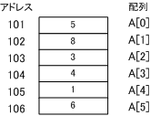

- データにアクセスするにはインデックスを指定する
- アクセス時間はインデックスを指定するだけなので$\mathcal{O}(1)$ 
- データ追加時間は配列の要素をズラすので$\mathcal{O}(n)$
- メモリ上でデータが順番に並んでいる

---

### 色々な配列
1. 多次元配列
    配列のインデックスが2以上になったもの。
    配列の中に配列が入る構造。（例：a[1][2]のように書く）

2. 静的配列
    決まった要素数しか格納できない配列

3. 動的配列
    要素数によって自動的にサイズが変わる配列

---

# 3. リスト
#### データと次のデータを格納しているアドレスを格納する方式
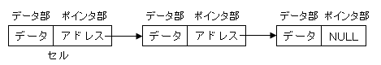 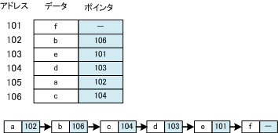

- データにアクセスするにはアドレスを指定する
- アクセス時間はアドレスを順番に辿るので$\mathcal{O}(n)$
- データ追加時間はアドレスを変更するだけなので$\mathcal{O}(1)$
- メモリ上でデータが順番に並んでいるとは限らない

--- 

### 色々なリスト

1. 単方向リスト
    後ろのデータのアドレスを持つリスト
    

2. 双方向リスト
    前後のデータのアドレスを持つリスト
    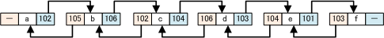

3. 循環リスト
    最後のデータが最初のデータのアドレスを持つリスト
    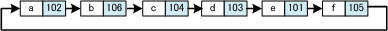
    $cf.$ データ格納用バッファの管理によく使われるらしい...

---

# 4. スタックとキュー
##### スタック：最後に格納したデータを最初に取り出せる方式
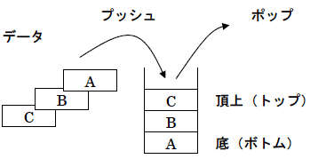

- データを追加する操作をプッシュという。処理時間は$\mathcal{O}(1)$
- データを取り出す操作をポップという。処理時間は$\mathcal{O}(1)$
- 使用例：再帰関数の再帰呼び出し、エディタのundo処理 

---     
# 4. スタックとキュー
##### キュー：最初に格納したデータを最初に取り出せる方式
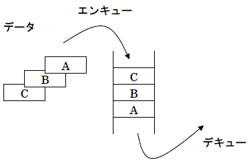

- データを追加する操作エンキューという。処理時間は$\mathcal{O}(1)$
- データを取り出す操作をデキューという。処理時間は$\mathcal{O}(1)$
- 使用例：印刷機のジョブスケーリング、非同期データ転送

---

# 5. 木構造
### データを階層構造で格納する方式
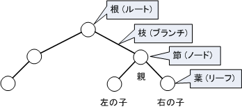

- 一番根本の要素を根（ルート）とよぶ
- 途中の要素を節（ノード）とよぶ
- 節と節をつなげる部分を枝（ブランチ）とよぶ
- 枝の一番先端にある要素を葉（リーフ）とよぶ

---
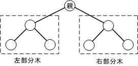

- 木構造の内の一部分を部分木とよぶ（左部分木、右部分木）
- 使用例：ディレクトリの階層構造

---

### 色々な木構造

- 2分木
    枝に結ばれている要素が 2 つ以下で、右と左の要素を区別する木

- 完全2分木
    根から深さの小さい順に、かつ同じ深さでは左から順に節を
    詰めた2分木(木の深さがすべて等しい)

- 2分探索木
    各節点が持つデータについて、「左部分木の値< 親 < 右部分木の値」となっている2分木

---

### 色々な木構造

- 平衡木
    バランス木(平衡木)	どの葉に至るまでも枝の数（木の深さ）がほぼ等しい木

- ヒープ木
    各節点について、「親 ≤ 子 (親 ≥ 子)」となっている2分木

- AVL木
    各節点について、左部分木と右部分木の高さの差が±1までにおさまる2分探索木
---

### 色々な木構造

- B木
    全ての葉の深さが同じである木

- 順序木
    節の値に順序がある木

- 多分木
    節から分岐する枝が2以上の木

---

## 木構造の探索
木構造の探索は配列やリストの探索のように単純ではない。
探索の方法には”幅優先探索”と”深さ優先探索”の２つがある。
（下記の図の上が”幅優先探索”、下が”深さ優先探索”）
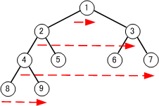
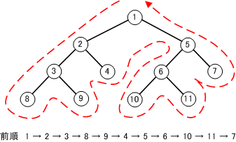

---

### 幅優先探索
根から浅い節を先に探索し、同じ深さの節を探索し終えれば、次に深い節を探索する。

- 根から最も近いデータを探索したいときに使う
- データが大量・探索範囲が広い場合に使う

---

### 深さ優先探索
根から順に深くなる節を探索し、一番深い所まで探索し終えれば、また、上から順に深くなるように探索する。

- データを全通り列挙したいときに使う

--- 

# 6. まとめ

- データ構造についてまとめた
- 配列、リスト、スタックとキュー、木構造について簡単に説明した

---

### 深さ優先探索の種類
- 前順
    根→左部分木→右部分木の順で探索

    

--- 

### 深さ優先探索の種類
- 中間順
    左部分木→根→右部分木の順で探索

    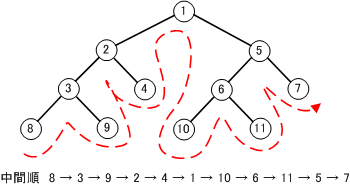

---

### 深さ優先探索の種類
- 後順
    左部分木→右部分木→根の順で探索

    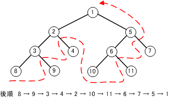
