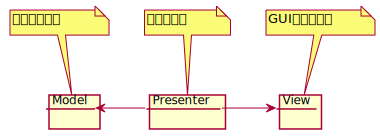
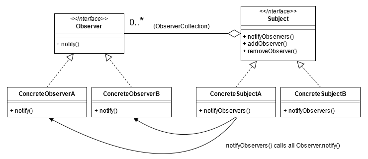
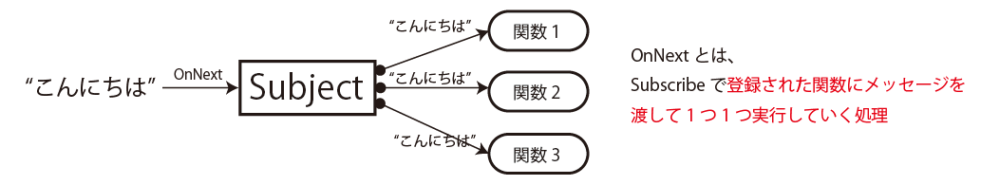

<!--
_class: lead
_paginate: false
_header: ""
-->

# UniRx

2022/07/09

# 目次

- 導入

- Model-View-Presenter

- Observerパターン

- UniRx

# 導入

Unityでアプリを作成する上で必要になる知識を勉強中

- 設計アーキテクチャのModel-View-Presenterを知りたい

- Unityでの非同期処理の扱いを知りたい

# Model-View-Presenter

 設計アーキテクチャの１つ

メリット

- Presenterが存在しなければ、ViewとModelは完全に独立した状態になる
  → データ制御とGUI制御を別々に考えられる

# Observerパターン

クラスのデザインパターンの一つ

- プログラム内のオブジェクトに関するイベント（事象）を他のオブジェクトへ通知する処理で使われる（[Observerパターン -Wikipedia](https://ja.wikipedia.org/wiki/Observer_%E3%83%91%E3%82%BF%E3%83%BC%E3%83%B3#:~:text=Observer%20%E3%83%91%E3%82%BF%E3%83%BC%E3%83%B3%EF%BC%88%E3%82%AA%E3%83%96%E3%82%B6%E3%83%BC%E3%83%90%E3%83%BC%E3%83%BB%E3%83%91%E3%82%BF%E3%83%BC%E3%83%B3%EF%BC%89,%E3%81%AA%E3%82%8B%E3%81%93%E3%81%A8%E3%81%8B%E3%82%89%E3%80%81%E3%81%93%E3%81%86%E5%91%BC%E3%81%B0%E3%82%8C%E3%82%8B%E3%80%82))

# UniRx

Unityの[Rx](https://reactivex.io/)系ライブラリ

- Observerパターンが実装されている
- MVPアーキテクチャを実現する上に使える

下の図のような非同期処理が実装しやすくなる

[Qiitaの記事](https://qiita.com/toRisouP/items/00b8a5bb8e7b68e0686c)で勉強中。。。
