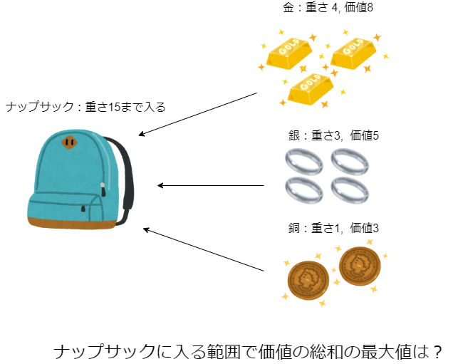
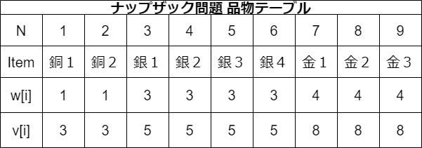

---
marp: true
theme: default
paginate: true
header: "**乙夜の会**"
footer: "by **@shimamoto**"
backgroundColor: white
math: katex
headingDivider: 1
size: 16:9
style: |
      img[alt ~= "center"] {
            display: block;
            margin: 0 auto;
      }
      section {
            justify-content: normal;
      font-size: 30px;
      font-family: "Arial", "Hiragino Kaku Gothic ProN";
      }
      section.lead {
            justify-content: center;
            text-align: center;
      font-size: 40px;
      }
      section.contents {
          font-size: 40px;
      }
--- 

<!--
_class: lead
_paginate: false
-->

# ナップサック問題で学ぶ動的計画法

2022/06/04

# 目次

<!--
_class: contents
-->

1. ナップサック問題
2. 動的計画法

# 1. ナップザック問題

愚直に調べると計算量は$\mathcal{O}({2^{n})}$
　→　もっと効率的に調べられないか？ →　$\bm{動的計画法}$

# 2. 動的計画法

 動的計画法のポイント

1. 全体問題を部分問題に分割化

2. 途中の計算結果を保持

# 3. ナップサック問題での動的計画法

問題の定式化

  
N = 9 個の品物があり、i 番目の重さは w[i], 価値は v[i] である。このとき、ナップサックの上限重量 W = 15 を超えない範囲で価値の総和の最大値を求める

# 3. ナップサック問題での動的計画法

## 1. 全体問題を部分問題に分割化

i 個までの部分問題に分けて、上限重量がjでの価値の総和の最大値を考える。

このとき、

i 番目の品物を選ぶ場合と選ばない場合の両方のパターンがある。

また、j = i - 1 個の部分問題の上限重量 + v[j]

# 3. ナップサック問題での動的計画法

## 1. 全体問題を部分問題に分割化  

例 i = 1, w = 1 のとき

銅1を選ぶか選ばないか

- 選ぶ　→ + 3,
- 選ばない　→ + 0

このときは銅1を選ぶパターンを選択する

# 3. ナップサック問題での動的計画法

## 2. 途中の計算結果を保持

i 個までの部分問題に分けて、上限重量がjの価値の総和の最大値を保持

例：i = 1, w = 1のとき

dp[1][1] = 3, dp: 価値の総和の最大値を保持する配列

このdpは次の計算に使用する

# 3. ナップサック問題での動的計画法

例：i = 2, w = 2のとき

銅2を選ぶか選ばないか

- 選ぶ　→ + dp[1][1] + 3 = 6
- 選ばない　→ + dp[1][1] = 3

dp[2][2] = 6

# 3. ナップサック問題での動的計画法

例：i = 3, w = 3のとき

銅2を選ぶか選ばないか

- 選ぶ　→ + dp[2][0] + 3 = 3 ,
- 選ばない　→ + dp[2][2] = 6

dp[3][3] = 6

# ex 

- 数学的には漸化式を利用した方法といえる

     #### 品物を選ぶ場合
     $\rm{dp}_{i+1, w} = Max(dp_{i+1, w},  dp_{i, w - w_{i}} + v_{i})$

     ### 品物を選ばない場合
     $\rm{dp}_{i+1, w} = Max(dp_{i+1, w},  dp_{i, w})$

     dp : 途中総重量wにおける価値を保存しているテーブル  
     $\rm{w_{i}}$: ある品物の重量
     $\rm{v_{i}}$: ある品物の価値
