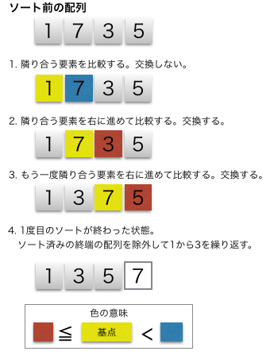
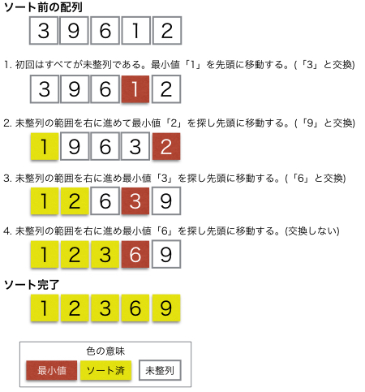
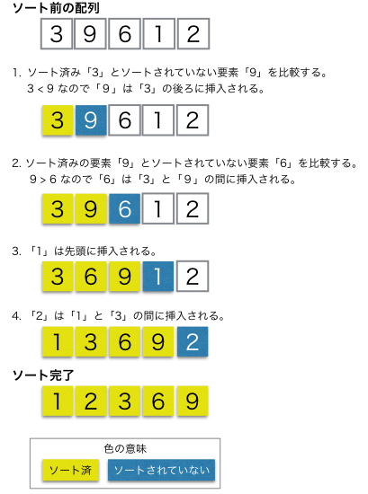
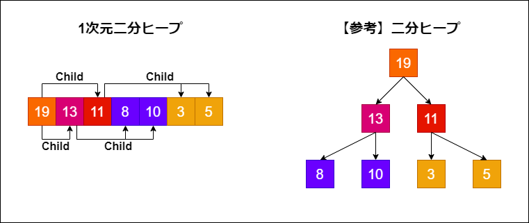
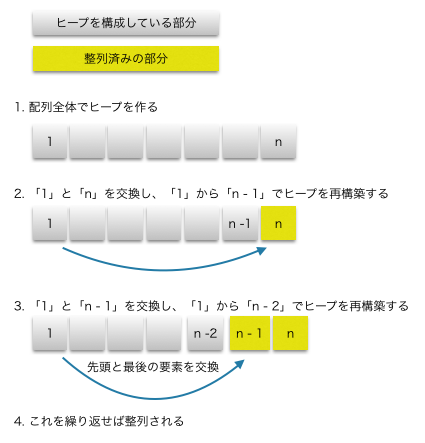

# 色々なソート 1
## 目次
- バブルソート
- 選択ソート
- 挿入ソート
- ヒープソート
- まとめ

---
# バブルソート
- 隣り合う2つの数字を比較して入れ替えていくソート方法
- 計算時間は$\mathcal{O}(n^{2})$（比較回数がn-1, n-2, n-3, ..., 1と減っていくため）

---
###### バブルソートの図 https://www.codereading.com/algo_and_ds/algo/bubble_sort.html

---
# 選択ソート
- 最小値を線形探索し、未確定の先頭データと入れ替ていく方法
- 計算時間は$\mathcal{O}(n^{2})$（比較回数がn-1, n-2, n-3, ..., 1と減っていくため）

---
###### 選択ソートの図 https://www.codereading.com/algo_and_ds/algo/selection_sort.html

---
# 挿入ソート
- 未確定のデータ領域のデータを一つ持ってきて、ソート済みのデータに挿入していくソート方法
- 計算時間は$\mathcal{O}(n^{2})$（比較回数がn-1, n-2, n-3, ..., 1と減っていくため）

---
###### 挿入ソートの図 https://www.codereading.com/algo_and_ds/algo/insertion_sort.html

---
# ヒープソート
- ヒープの先頭データ（最小値か最大値となる）をポップしていくソート方法
- 計算時間は$\mathcal{O}(n \log n)$（n個の数字からヒープを作る時間 +  ヒープを再構築する時間）

---
###### ヒープ図 https://novnote.com/priority-queue-heapsort-impl-cpp/565/

---
###### ヒープソートの図 https://www.codereading.com/algo_and_ds/algo/heap_sort.html

---
# まとめ
- バブルソート、選択ソート、挿入ソート、ヒープソートを説明、実装
- とくに、ヒープソートの実装が難しかった。。。

###### 参考URL・書籍
###### ソート全般について: https://www.codereading.com/
###### ヒープソートについて: https://novnote.com/priority-queue-heapsort-impl-cpp/565/
###### 「アルゴリズム図鑑」石田保輝, 宮崎修一著（翔泳社）

 次回につづく（マージンソート、クイックソートなど）
